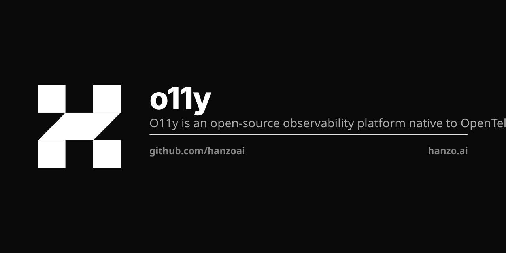

<p align="center"></p>

# o11y

Metrics, traces and logs for the Hanzo platform, in one place. OpenTelemetry on the wire,
[Hanzo Datastore](https://github.com/hanzoai/datastore) — an OLAP column store — on disk.

[](LICENSE)

## Run it

```bash
cd deploy/docker
docker compose up -d
```

Open <http://localhost:8080>. `deploy/install.sh` does the same thing with a few more
checks, and `deploy/docker/docker-compose.ha.yaml` is the multi-replica variant.

## Send it data

The collector listens for OTLP on `4317` (gRPC) and `4318` (HTTP). Point any
OpenTelemetry SDK or the OTel Collector at it:

```bash
export OTEL_EXPORTER_OTLP_ENDPOINT=http://localhost:4318
```

Traces, metrics and logs land in Datastore and show up under APM, Logs, Traces, Metrics
and Exceptions in the UI. Dashboards and alerting are built on the same queries.

## What it is for

Every Hanzo service emits here. It is multi-tenant by design: queries scope by org from
the `X-Org-Id` claim in the JWT, on every panel. It sits behind `gateway` like the other
Hanzo subsystems, and mounts under the unified cloud binary per HIP-0106.

```
   instrumented app  ->  OTLP  ->  o11y collector
                                       |
                                 Hanzo Datastore
                                       |
                             APM | logs | traces | metrics
                                       |
                          queries scoped by X-Org-Id from JWT
                                       |
                          dashboards | alerting | exceptions
```

## Docs

- [`deploy/README.md`](deploy/README.md) — every deployment path in detail
- [`docs/`](docs/) — configuration, contributing notes, the OTel demo walkthrough
- [`LLM.md`](LLM.md) — architecture and the conventions that apply in this repo
- [`CONTRIBUTING.md`](CONTRIBUTING.md)

## Lineage

2020–present SigNoz Inc.), synced to upstream `main` at commit `3e6339019`. The import
history was squashed, so the root commit here is a Hanzo branding commit rather than
upstream's history. See [`NOTICE`](NOTICE).

## License

MIT — see [LICENSE](LICENSE).
